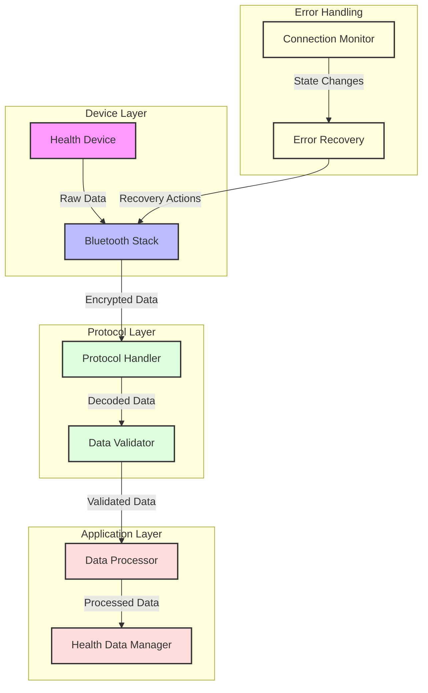

# Bluetooth Communication Layer

## Introduction

In the world of health technology, reliable communication between devices is as crucial as the data they collect. The Bluetooth Communication Layer acts as the digital nervous system of our health app, orchestrating the complex dance of data transfer between smartphones and health devices. Think of it as a sophisticated translator that not only speaks the language of Bluetooth but also ensures secure and efficient communication.

## The Communication Challenge

Imagine Sarah, a fitness enthusiast who uses multiple health devices. Her smartwatch needs to transmit heart rate data every second, while her fitness band sends step counts and sleep data. The Bluetooth Communication Layer must handle these diverse data streams while maintaining battery efficiency and ensuring data integrity.

## Understanding the Communication Layers

The Bluetooth Communication Layer implements a sophisticated protocol stack that handles everything from device discovery to secure data transfer. Let's explore how it works through the eyes of a data packet's journey.

### Device Discovery and Connection

When Sarah's smartwatch comes within range, the discovery process begins:

```java
// From bhv.java - Device discovery and connection
public class bhv {
    public void rN_(final BluetoothSocket bluetoothSocket, final int i) {
        synchronized (e) {
            // Clean up any existing connection
            if (this.l != null) {
                this.l.c();
                this.l = null;
            }
            
            // Initialize new data transfer thread
            a aVar2 = new a(bluetoothSocket, i);
            this.l = aVar2;
            
            // Set up error handling
            aVar2.setUncaughtExceptionHandler(new Thread.UncaughtExceptionHandler() {
                @Override
                public void uncaughtException(Thread thread, Throwable th) {
                    LogUtil.a("InoperableBrPhysicalService", "data transfer thread occur uncaughtException.");
                    synchronized (bhv.e) {
                        // Attempt recovery on failure
                        if (bhv.this.l != null) {
                            bhv.this.l.c();
                            bhv.this.l = null;
                        }
                        bhv.this.l = new a(bluetoothSocket, i);
                        bhv.this.l.start();
                    }
                }
            });
            this.l.start();
        }
    }
}
```

This code in `bhv.java` demonstrates the robust connection handling system. The method `rN_` takes a Bluetooth socket and channel number as parameters, setting up a dedicated thread for data transfer. The synchronized block ensures thread safety during connection setup, while the uncaught exception handler provides automatic recovery from communication errors.

The connection process is like establishing a secure phone line between devices. The system first cleans up any existing connections, then creates a new data transfer thread with proper error handling. This ensures that even if something goes wrong, the system can recover and maintain the connection.

### Data Transfer and Protocol Management

Once connected, the system manages data transfer through a sophisticated protocol:

```java
// From izp.java - Data transfer management
public class izp {
    private void l(DeviceInfo deviceInfo, byte[] bArr) {
        String d = blq.d(bArr);
        LogUtil.c("BTDeviceSendCommandUtil", "Notification info: ", d);
        
        // Protocol version handling
        if (c(bArr)) {
            bArr = iyt.a(bArr[1], bArr[2], bArr[3], blq.a(d));
            blt.d("BTDeviceSendCommandUtil", bArr, "after V1--->V2 Notification info: ");
        }
        
        // Data processing and forwarding
        if (bArr != null) {
            this.y.onDataReceived(deviceInfo, bArr.length, bArr);
        } else {
            LogUtil.a("BTDeviceSendCommandUtil", "0xA0200008", "notificationData is null.");
        }
    }
}
```

The data transfer system in `izp.java` shows how the layer handles different protocol versions and data formats. The method `l` processes incoming data packets, handling protocol version conversion and ensuring data integrity before forwarding it to the appropriate handlers.

The system acts like a skilled translator, converting between different protocol versions (V1 and V2) while maintaining data consistency. The logging system provides visibility into the communication process, helping developers track and debug any issues.

### Connection State Management

The layer maintains connection state through a sophisticated state machine:

```java
// From izy.java - Connection state management
public class izy {
    public void b(DeviceInfo deviceInfo, int i, OperationDeviceInfo operationDeviceInfo) {
        if (this.y == null || deviceInfo == null) {
            LogUtil.a("BTDeviceSendCommandUtil", "0xA0200008", "Parameter is incorrect.");
            return;
        }
        
        LogUtil.c("BTDeviceSendCommandUtil", "DeviceProtocol:", 
            Integer.valueOf(deviceInfo.getDeviceProtocol()), 
            "device state changed, btState:", Integer.valueOf(i));
            
        // Handle connection state changes
        if (1 == i) {
            q();
        } else {
            LogUtil.c("BTDeviceSendCommandUtil", "Start to remove connect timeout message.");
            this.ap.removeMessages(2);
        }
        
        // Process connection state
        if (2 != i) {
            e(deviceInfo, i, operationDeviceInfo);
            return;
        }
        
        // Handle connection establishment
        if (2 == this.m) {
            LogUtil.c("BTDeviceSendCommandUtil", "Already finish handshake and repeat report connected.");
            return;
        }
        
        // Initialize handshake process
        if (this.ai) {
            LogUtil.c("BTDeviceSendCommandUtil", "Already Start handshake.");
            return;
        }
        
        this.ai = true;
        this.ap.removeMessages(3);
        this.av = true;
        this.ap.sendEmptyMessage(3, 60000L);
        
        // Set device protocol
        int i2 = this.r;
        if (i2 == 0 || i2 == 5) {
            deviceInfo.setDeviceProtocol(2);
            this.am = 2;
            LogUtil.c("BTDeviceSendCommandUtil", "Set init AW Device Protocol : ", 2);
        }
        d(deviceInfo, i, operationDeviceInfo);
    }
}
```

The connection state management in `izy.java` demonstrates how the system handles the complex lifecycle of Bluetooth connections. The method `b` processes state changes, manages timeouts, and coordinates the handshake process between devices.

The state machine is like a traffic controller, ensuring that devices follow the correct sequence of operations during connection establishment and maintenance. The system handles various states:
- Initial connection
- Handshake process
- Protocol negotiation
- Connection maintenance
- Error recovery

## Data Flow Diagram



## Integration with Other Components

The Bluetooth Communication Layer doesn't work in isolation. It's part of a sophisticated ecosystem of components that work together to deliver a seamless health monitoring experience. Let's explore how it interacts with other key components of the system.

### Device Connection Manager

The Device Connection Manager and Bluetooth Communication Layer form a powerful partnership. The Communication Layer acts as the technical foundation, handling the low-level Bluetooth operations, while the Connection Manager provides the high-level orchestration. When a new device comes into range, the Connection Manager initiates the discovery process, but it's the Communication Layer that handles the actual Bluetooth scanning and device identification. This separation of concerns allows each component to focus on its specific responsibilities while maintaining a cohesive system.

### Health Data Manager

The relationship between the Bluetooth Communication Layer and Health Data Manager is one of data transformation and delivery. The Communication Layer acts as the data pipeline, receiving raw bytes from connected devices and transforming them into structured data packets. These packets are then passed to the Health Data Manager, which processes and stores the information. This handoff is crucial for maintaining data integrity and ensuring that health metrics are properly recorded and available for analysis. The Communication Layer's role in this process is to ensure that data is transmitted reliably and securely, while the Health Data Manager focuses on making sense of that data and storing it appropriately.

### Security Layer

Security is paramount in health applications, and the Bluetooth Communication Layer works closely with the Security Layer to ensure data protection. The Communication Layer handles the technical aspects of secure communication, implementing encryption for data transfer and managing secure pairing processes. The Security Layer provides the cryptographic keys and authentication mechanisms needed for these operations. Together, they create a robust security framework that protects sensitive health data during transmission. This collaboration ensures that data remains confidential and tamper-proof as it moves between devices.

## Conclusion

The Bluetooth Communication Layer is the unsung hero of the health app, working tirelessly behind the scenes to ensure reliable and secure communication between devices. Through its sophisticated protocol handling, robust error recovery, and efficient data transfer mechanisms, it enables the seamless flow of health data that powers the app's features.

[Next: Health Data Manager](health_data_manager.md) 