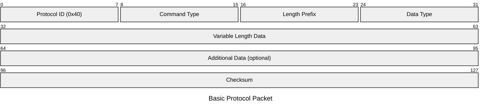
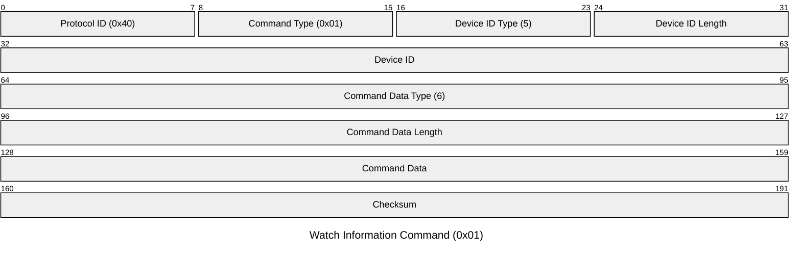
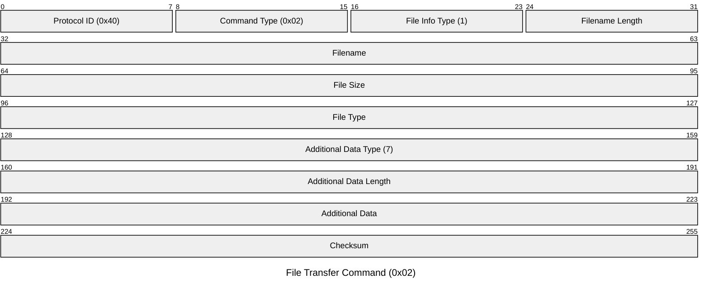
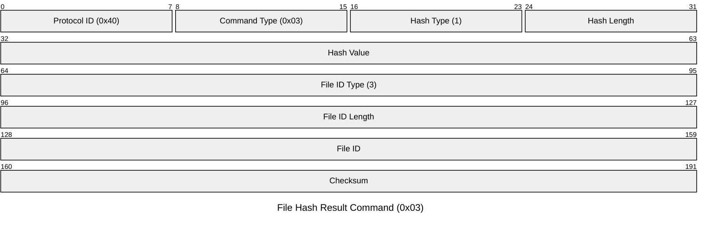
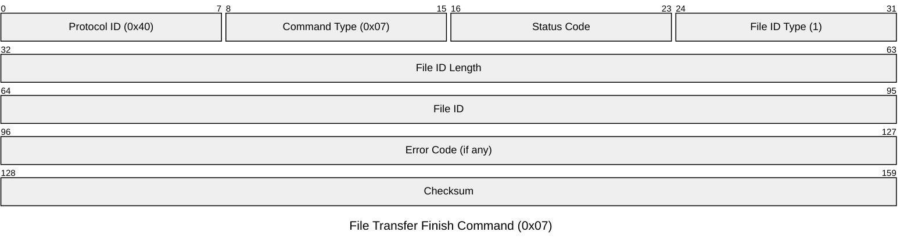
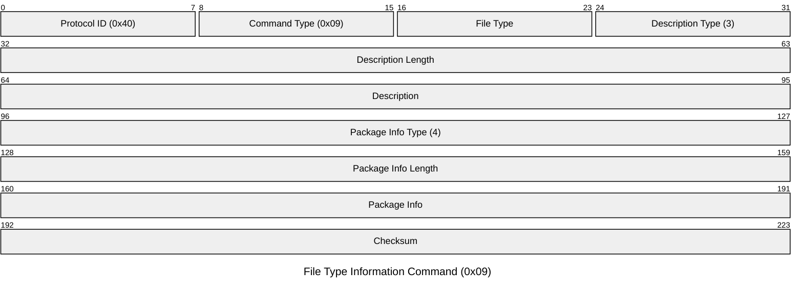

There are several protocols used in the system:

1. **PROTOCOL_TYPE_5A** (Bluetooth Classic)
   - Used for file transfers and large data transfers
   - Implemented in `bkn.java`
   - Uses socket-based communication
   - Handles file transfer commands and device information

2. **PROTOCOL_TYPE_D** (Direct Protocol)
   - Implemented in `bkq.java`
   - Used for direct device communication
   - Simpler protocol for basic commands

3. **PROTOCOL_TYPE_DIRECT** (Direct Communication)
   - Implemented in `bkr.java`
   - Used for immediate device communication
   - No fragmentation or complex packaging

4. **PROTOCOL_TYPE_FRAGMENT** (Fragmented Protocol)
   - Implemented in `bko.java`
   - Used for breaking large data into smaller chunks
   - Handles data fragmentation and reassembly
   - Useful for BLE devices with MTU limitations

The protocols are mapped in `bgo.java`:
```java
HashMap hashMap3 = new HashMap(5);
b = hashMap3;
hashMap3.put(SendMode.PROTOCOL_TYPE_5A, bkn.class.getName());
hashMap3.put(SendMode.PROTOCOL_TYPE_D, bkq.class.getName());
hashMap3.put(SendMode.PROTOCOL_TYPE_DIRECT, bkr.class.getName());
hashMap3.put(SendMode.PROTOCOL_TYPE_FRAGMENT, bko.class.getName());
```

Each protocol serves a specific purpose:
1. **PROTOCOL_TYPE_5A**: Used for file transfers and large data transfers over Bluetooth Classic
2. **PROTOCOL_TYPE_D**: Used for direct device communication with minimal overhead
3. **PROTOCOL_TYPE_DIRECT**: Used for immediate device communication without packaging
4. **PROTOCOL_TYPE_FRAGMENT**: Used for BLE devices to handle data fragmentation

The system also supports different connection modes:
1. **GENERAL**: General purpose connection
2. **SIMPLE**: Simplified connection for basic operations
3. **TRANSPARENT**: Transparent connection for direct data transfer


# File Transfer Protocol Analysis

## Overview
This document analyzes the file transfer protocol used in the Huawei Health application for transferring files (particularly audio files) to connected devices. The protocol is implemented primarily in `sor.java` (TransFileCommandUtills) and related classes.

## Protocol Structure

### Basic Packet Format
Each packet consists of:
1. Protocol Header (2 bytes)
   - First byte: `0x40` (Protocol identifier)
   - Second byte: Command type
2. Payload (variable length)
   - Command-specific data structure
   - Length prefixes for variable fields



### Command Types
The protocol supports multiple command types, identified by the second byte in the header:

1. `0x01` - Watch Information Command
   - Used for device-specific information exchange
   - Device ID Type (1 byte): Type 5 for device identifier
   - Device ID Length (variable): Length of the device identifier
   - Device ID (variable): Unique device identifier string
   - Command Data Type (1 byte): Type 6 for command data
   - Command Data Length (variable): Length of the command data
   - Command Data (variable): Actual command information



2. `0x02` - File Transfer Command
   - Used for transferring music and other files
   - File Info Type (1 byte): Type 1 for file information
   - Filename Length (variable): Length of the filename
   - Filename (variable): Name of the file to transfer
   - File Size (4 bytes): Size of the file in bytes
   - File Type (1 byte): Type of file (e.g., 2 for music)
   - Additional Data Type (1 byte): Type 7 for package info
   - Additional Data Length (variable): Length of package info
   - Additional Data (variable): Package name and certificate info



3. `0x03` - File Hash Result Command
   - Used for file integrity verification
   - Hash Type (1 byte): Type 1 for hash information
   - Hash Length (1 byte): Length of hash value (typically 1)
   - Hash Value (variable): Hash of the file content
   - File ID Type (1 byte): Type 3 for file identifier
   - File ID Length (variable): Length of file identifier
   - File ID (variable): Unique identifier for the file



4. `0x07` - File Transfer Finish Command
   - Signals completion of file transfer
   - Status Code (1 byte): Transfer status (0 for success)
   - File ID Type (1 byte): Type 1 for file identifier
   - File ID Length (1 byte): Length of file identifier (typically 1)
   - File ID (variable): Unique identifier for the file
   - Error Code (4 bytes, optional): Error code if transfer failed



5. `0x09` - File Type Information Command
   - Provides file type and format information
   - File Type (1 byte): Type of file
   - Description Type (1 byte): Type 3 for description
   - Description Length (variable): Length of description
   - Description (variable): File format description
   - Package Info Type (1 byte): Type 4 for package info
   - Package Info Length (variable): Length of package info
   - Package Info (variable): Package name and certificate



## Detailed Command Structures

### Watch Information Command (Type 1)
The command structure consists of three main components:
1. File information section containing metadata about the file
2. Device ID section with a type identifier and length-prefixed device identifier
3. Command data section containing the actual command information

### File Transfer Command (Type 2)
The command structure for music files includes:
1. File information section with metadata
2. Additional file data section containing format-specific information
3. Optional package information for certain file types

### File Info Packet Structure
The file information packet contains three main sections:
1. File info section with type identifier and length-prefixed filename
2. Size info section with format identifier and size value
3. Type info section with format identifier and type value

## Protocol Flow

### 1. Command Construction
The command construction process involves:
1. Creating the base file information
2. Adding command-specific data
3. Assembling the final packet with protocol header

### 2. Command Sending
The command sending process includes:
1. Setting the protocol type (PROTOCOL_TYPE_5A)
2. Preparing the command data
3. Sending to the target device

## File Transfer Process

### 1. Initialization
- Device connection verification
- Protocol version negotiation
- File type compatibility check

### 2. File Information Exchange
- File metadata transfer
- Size and type verification
- Transfer parameters negotiation

### 3. Data Transfer
- Chunked data transfer
- Progress tracking
- Error handling

### 4. Completion
- Transfer verification
- Status reporting
- Cleanup

## Protocol Features

### 1. Length Prefixing
- Variable-length fields are prefixed with their length
- Length is encoded in a specific format
- Ensures correct parsing of variable-length data

### 2. Protocol Type
- Uses `PROTOCOL_TYPE_5A` for file transfers
- Different protocol types for different operations
- Protocol version negotiation

### 3. Error Handling
- Commands include error checking
- Invalid commands are logged and rejected
- Device-specific error handling
- Transfer recovery mechanisms

### 4. Security Features
- Command validation
- Data integrity checks
- Device authentication
- Package name verification

## Example Command Flow

1. **Watch Info Command**:
```
[0x40][0x01][FileInfo][DeviceID][CommandData]
```

2. **File Transfer Command**:
```
[0x40][0x02][FileInfo][AdditionalData]
```

3. **File Hash Result**:
```
[0x40][0x03][HashInfo][FileID]
```

4. **Transfer Finish**:
```
[0x40][0x07][Status][FileID]
```

## Implementation Details

### Command Creation
The command creation process handles different command types:
1. Watch info commands require device ID and command data
2. Music file commands include additional file data
3. Special handling for online music sources

### Device ID Handling
The device ID processing includes:
1. Conversion of device identifier
2. Creation of length prefix
3. Assembly of final device ID packet

## Security Considerations

1. **Command Validation**
   - Commands are validated before processing
   - Invalid command types are rejected
   - File information is verified
   - Package name validation

2. **Data Integrity**
   - Length prefixes ensure correct data parsing
   - Command structure validation
   - Device-specific validation
   - Hash verification

3. **Authentication**
   - Device ID verification
   - Package name checks
   - Certificate validation

## Protocol Limitations

1. **Command Types**
   - Limited to predefined command types
   - No extensible command structure
   - Fixed header format

2. **Data Size**
   - Fixed header size
   - Variable payload size with length prefixing
   - Maximum file size limitations

3. **Device Compatibility**
   - Specific handling for different device types
   - Limited to supported file types
   - Protocol version dependencies

## Future Considerations

1. **Protocol Extensions**
   - Support for new command types
   - Enhanced error handling
   - Additional security features
   - Improved compression

2. **Performance Optimization**
   - Batch command processing
   - Improved error recovery
   - Enhanced logging and debugging
   - Better chunking strategies

## Conclusion
The file transfer protocol provides a robust mechanism for transferring files to connected devices. Its structure allows for different types of commands and data, with built-in error handling and validation. The protocol's design supports both simple and complex file transfer scenarios, with specific handling for different device types and file formats. The implementation includes comprehensive security measures and error handling mechanisms to ensure reliable file transfers. 