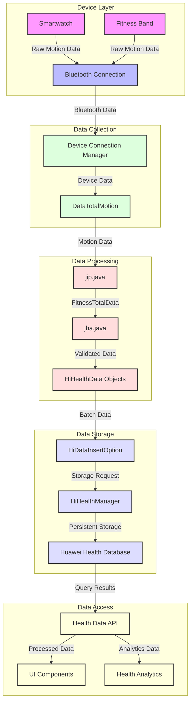

# Health Data Manager

## Introduction

In the world of health and fitness technology, data is the lifeblood of user experience. The Health Data Manager is like a sophisticated medical records system that orchestrates the collection, storage, and synchronization of health metrics. Think of it as a digital health vault that not only stores your fitness achievements but also ensures they're accessible, secure, and meaningful.

## The Data Challenge

Let's meet Sarah, a fitness enthusiast who uses multiple health devices. Sarah's health data needs to be:
- Accurately recorded from various devices
- Securely stored and synchronized
- Easily accessible for analysis
- Properly categorized and organized

### The Data Complexity

Health apps face a unique challenge: they need to handle diverse types of data while maintaining accuracy and reliability. The Health Data Manager addresses this by implementing a robust data management system.

## Understanding the Data Layers

The Health Data Manager implements multiple layers of data handling, each serving a specific purpose in managing health information.

### Fitness Data Management

When Sarah completes her morning run, the Health Data Manager processes the workout data:

```java
// From jip.java - Fitness data management
private FitnessTotalData d(jik jikVar, DataTotalMotion dataTotalMotion) {
    FitnessTotalData fitnessTotalData = new FitnessTotalData();
    fitnessTotalData.setSteps(dataTotalMotion.getStep());
    if (jikVar != null) {
        if (jikVar.e()) {
            fitnessTotalData.setHeight(dataTotalMotion.getDistance());
        } else {
            fitnessTotalData.setHeight(dataTotalMotion.getHeight());
            fitnessTotalData.setDistance(dataTotalMotion.getDistance());
        }
    }
    return fitnessTotalData;
}
```

This code in `jip.java` implements the core fitness data processing logic. The method `d` takes two key parameters: a device configuration object (`jikVar`) that determines how to interpret the motion data, and the raw motion data itself (`dataTotalMotion`) which contains the actual measurements. 

The method creates a new `FitnessTotalData` object, which is Huawei's standardized structure for storing fitness metrics. It first processes the step count by directly mapping it from the motion data using `setSteps()`. The interesting part comes in how it handles height and distance measurements. 

The device configuration object (`jikVar`) plays a crucial role here. Through its `e()` method, it tells us how to interpret the measurements. For some devices, the distance value should be used as the height measurement, while for others, we need to handle height and distance as separate metrics. This flexibility allows the system to work with different types of fitness devices, each with their own way of reporting measurements.

### Health Metrics Storage

The system implements sophisticated health metrics storage:

```java
// From jha.java - Health metrics storage
private void e(FitnessTotalData fitnessTotalData) {
    LogUtil.a("05", 1, "FitnessMgrStorage", "saveTodayTotal to hiHealth fitnessTotalData:", fitnessTotalData);
    long e2 = e(System.currentTimeMillis());
    
    // Validate step count
    if (fitnessTotalData.getSteps() > (((System.currentTimeMillis() - jdl.t(System.currentTimeMillis())) / 60000) + 1) * 500) {
        LogUtil.a("FitnessMgrStorage", "saveTodayTotalToHiHealth to Steps error: ", 
            Integer.valueOf(fitnessTotalData.getSteps()), " ,startTime: ", Long.valueOf(e2));
        return;
    }
    
    ArrayList arrayList = new ArrayList(16);
    // Process steps data
    if (fitnessTotalData.getSteps() > 0) {
        arrayList.add(d(40002, e2, System.currentTimeMillis(), fitnessTotalData.getSteps()));
        arrayList.add(d(901, e2, System.currentTimeMillis(), fitnessTotalData.getSteps()));
    }
    // Process calorie data
    if (fitnessTotalData.getCalorie() > 0) {
        arrayList.add(d(40003, e2, System.currentTimeMillis(), fitnessTotalData.getCalorie()));
        arrayList.add(d(903, e2, System.currentTimeMillis(), fitnessTotalData.getCalorie()));
    }
    // Process distance data
    if (fitnessTotalData.getDistance() > 0) {
        arrayList.add(d(40004, e2, System.currentTimeMillis(), fitnessTotalData.getDistance()));
        arrayList.add(d(902, e2, System.currentTimeMillis(), fitnessTotalData.getDistance()));
    }
}
```

The health metrics storage system in `jha.java` begins with a high-priority logging operation, marking the start of data processing. The method first calculates the start of the current day in milliseconds, which will be used as the base timestamp for all measurements. 

Before processing any data, the system performs a crucial validation step for step counts. It calculates the maximum allowed steps based on the time elapsed since the start of the day, using a sophisticated algorithm that limits steps to 500 per minute plus a buffer. This validation helps prevent unrealistic data from being stored, such as might occur from sensor errors or data corruption.

The actual data processing is quite elegant. For each type of measurement (steps, calories, and distance), the system creates two `HiHealthData` objects: one for the raw data and one for the processed data. This dual storage approach allows for both data verification and different types of analysis. The system uses Huawei's specific data type constants: 40002 for raw steps, 901 for processed steps, 40003 for raw calories, 903 for processed calories, 40004 for raw distance, and 902 for processed distance. Each measurement is only processed if it's greater than zero, ensuring we don't store meaningless data.

### Body Composition Data

The system handles detailed body composition measurements:

```java
// From qsj.java - Body composition data handling
public static void d(HiHealthData hiHealthData, cfe cfeVar) {
    hiHealthData.putDouble("bodyWeight", cfeVar.ax());
    hiHealthData.putDouble(BleConstants.BODY_FAT_RATE, cfeVar.a());
    hiHealthData.putDouble("bodyFat", cfeVar.c());
    hiHealthData.putDouble(BleConstants.IMPEDANCE, cfeVar.ae());
    hiHealthData.putDouble(BleConstants.MOISTURE, cfeVar.al());
    hiHealthData.putDouble(BleConstants.MOISTURE_RATE, cfeVar.ap());
    hiHealthData.putDouble(BleConstants.VISCERAL_FAT_LEVEL, cfeVar.s());
    hiHealthData.putDouble(BleConstants.BONE_SALT, cfeVar.i());
    hiHealthData.putDouble(BleConstants.BMI, cfeVar.j());
    hiHealthData.putDouble(BleConstants.BASAL_METABOLISM, cfeVar.d());
    hiHealthData.putDouble(BleConstants.MUSCLE_MASS, cfeVar.z());
    // ... additional body composition metrics
}
```

The body composition data processing in `qsj.java` demonstrates how the system handles the complex task of mapping device-specific measurements to Huawei's standardized health data format. The static method `d` takes two parameters: a `HiHealthData` object that will store the standardized measurements, and a device-specific data object (`cfeVar`) that contains the raw measurements.

The method systematically maps each measurement from the device-specific format to the standardized format. It handles a comprehensive set of body composition metrics, from basic measurements like weight and body fat percentage to advanced metrics like impedance and visceral fat levels. Each measurement is accessed through specific getter methods in the device data object (like `ax()` for weight) and stored in the standardized format using `putDouble()`.

The code uses Huawei's `BleConstants` to maintain consistency in field naming across the application. These constants represent various body composition metrics, such as body fat rate, impedance, moisture content, and basal metabolism. This standardization ensures that the data can be properly interpreted and used by other components of the system, regardless of which device provided the measurements.

## Data Synchronization and Storage

The Health Data Manager ensures data is properly synchronized and stored:

```java
// From jws.java - Data synchronization
private void e(ArrayList<HiHealthData> arrayList) {
    if (arrayList.size() > 0) {
        HiDataInsertOption hiDataInsertOption = new HiDataInsertOption();
        hiDataInsertOption.setDatas(arrayList);
        HiHealthManager.d(BaseApplication.getContext()).insertHiHealthData(
            hiDataInsertOption, 
            new HiDataOperateListener() {
                @Override
                public void onResult(int i, Object obj) {
                    if (obj != null) {
                        ReleaseLogUtil.e("R_HwBasicStorage", 
                            "saveTodayTotal to hiHealth onResult type:", 
                            Integer.valueOf(i), 
                            "insertHiHealthData object:", obj);
                    } else {
                        LogUtil.h("HwBasicStorage", "insertHiHealthData object is null");
                    }
                    if (i == 0) {
                        iyv.c();
                    }
                }
            });
    }
}
```

The data synchronization system in `jws.java` handles the critical task of storing health data in Huawei's health database. The method `e` takes an ArrayList of `HiHealthData` objects, which contains all the processed health metrics ready for storage. The system first checks if there's any data to store, and if so, creates a `HiDataInsertOption` object to configure the database insertion operation.

The actual data insertion is performed using Huawei's `HiHealthManager`, which is accessed through a singleton instance. The insertion is configured with the batch of data and a callback listener that handles the operation result. The callback implementation is particularly interesting as it uses different logging levels based on the result: detailed error logging with `ReleaseLogUtil.e()` for debugging purposes, and high-priority logging with `LogUtil.h()` for critical issues.

When the operation succeeds (indicated by a result code of 0), the system calls `iyv.c()` to trigger any necessary UI updates or notifications. This ensures that users see their latest health data reflected in the app's interface. The error handling is comprehensive, logging both the result type and the associated object for debugging purposes.

## Integration with Other Components

The Health Data Manager works closely with other system components:

### Device Connection Integration
- Receives data from connected devices
- Validates incoming measurements
- Processes device-specific data formats

### User Interface Integration
- Provides data for health dashboards
- Updates real-time metrics
- Triggers UI notifications for new data

### Cloud Integration
- Synchronizes data with cloud storage
- Handles offline data caching
- Manages data conflicts

## Best Practices for Health Data Management

To maintain data integrity and reliability, the Health Data Manager follows these best practices:

1. **Data Validation**
   - Implement range checks for measurements
   - Validate data consistency
   - Handle missing or corrupt data
   - Log data anomalies

2. **Storage Management**
   - Use efficient data structures
   - Implement proper indexing
   - Handle data versioning
   - Manage storage limits

3. **Synchronization**
   - Implement conflict resolution
   - Handle offline scenarios
   - Ensure data consistency
   - Manage sync priorities

4. **Security**
   - Encrypt sensitive data
   - Implement access controls
   - Audit data access
   - Protect user privacy

## Data Flow Diagram

The following diagram illustrates how fitness data flows through the system, from device collection to final storage:



### Flow Description

1. **Device Layer**
   - Smartwatches and fitness bands collect raw motion data
   - Data is transmitted via Bluetooth to the app
   - Multiple devices can connect simultaneously

2. **Data Collection**
   - Device Connection Manager (`izo.java`) receives Bluetooth data
   - Raw data is parsed into `DataTotalMotion` objects
   - Basic validation and device identification occurs

3. **Data Processing**
   - `jip.java` processes raw motion data into `FitnessTotalData`
   - `jha.java` performs validation and creates `HiHealthData` objects
   - Data is standardized and formatted for storage

4. **Data Storage**
   - Processed data is batched into `HiDataInsertOption`
   - `HiHealthManager` handles database operations
   - Data is stored in Huawei's Health Database

5. **Data Access**
   - Health Data API provides access to stored data
   - UI components display processed data to users
   - Analytics system processes data for insights

### Key Classes and Their Roles

- **Device Connection Manager** (`izo.java`): Handles device communication and data reception
- **Data Processing** (`jip.java`): Converts raw data into standardized format
- **Data Validation** (`jha.java`): Validates and processes fitness metrics
- **Data Storage** (`jws.java`): Manages database operations and data persistence
- **Health Manager** (`HiHealthManager`): Core class for health data management

### Data Transformation Steps

1. Raw motion data → `DataTotalMotion`
2. `DataTotalMotion` → `FitnessTotalData`
3. `FitnessTotalData` → `HiHealthData` objects
4. `HiHealthData` objects → Database records

This flow ensures that data is properly collected, validated, processed, and stored while maintaining data integrity and providing efficient access for the app's features.

## Conclusion

The Health Data Manager is more than just a storage system—it's the foundation of the health and fitness app's data infrastructure. By implementing robust data management practices while maintaining data integrity and security, it ensures that users like Sarah can trust their health data is being properly managed and protected.

[Next: Workout Manager](workout_manager.md) 